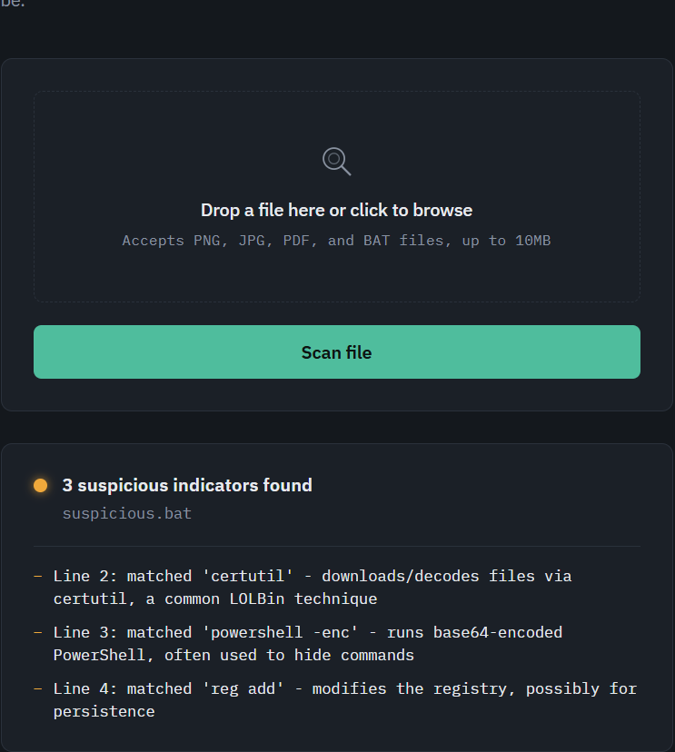

# Suspicious File Detector

A small Flask web app that scans uploaded images, PDFs, and `.bat` files for
heuristic signs of hidden data or malicious content, and reports a
suspicious/clean verdict.



## What it checks

- **Images (PNG/JPEG):** appended data after the image's real end-of-file
  marker, and file sizes that are unusually large for the image's pixel
  dimensions.
- **PDFs:** suspicious embedded objects (JavaScript, embedded files, launch
  actions) and trailing data appended after the file's final `%%EOF` marker.
- **.bat files:** suspicious keywords/commands commonly used for downloading
  or executing payloads (e.g. `certutil`, `powershell -enc`).

## Running it

```
pip install -r requirements.txt
python app.py
```

Then open http://127.0.0.1:5000 in your browser and upload a file.

## Running the tests

```
pytest
```

## Note

This is a learning/portfolio project. The checks are simple heuristics, not
a production-grade security tool.
